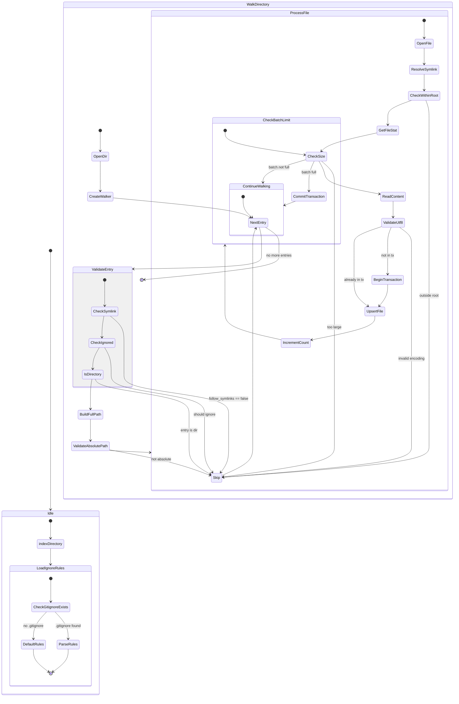
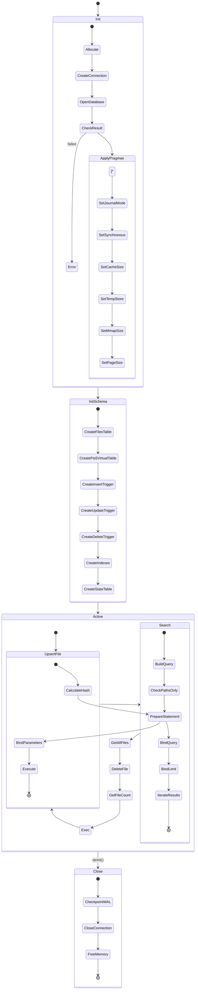
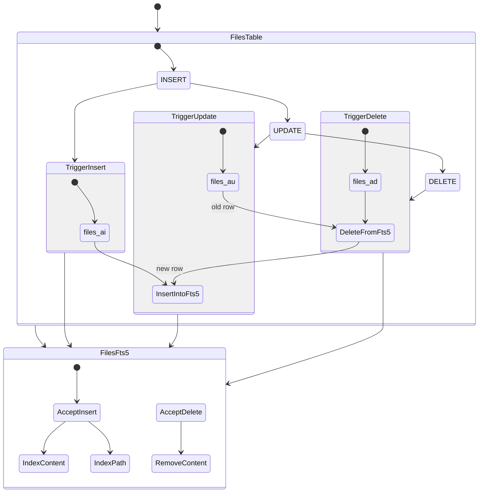
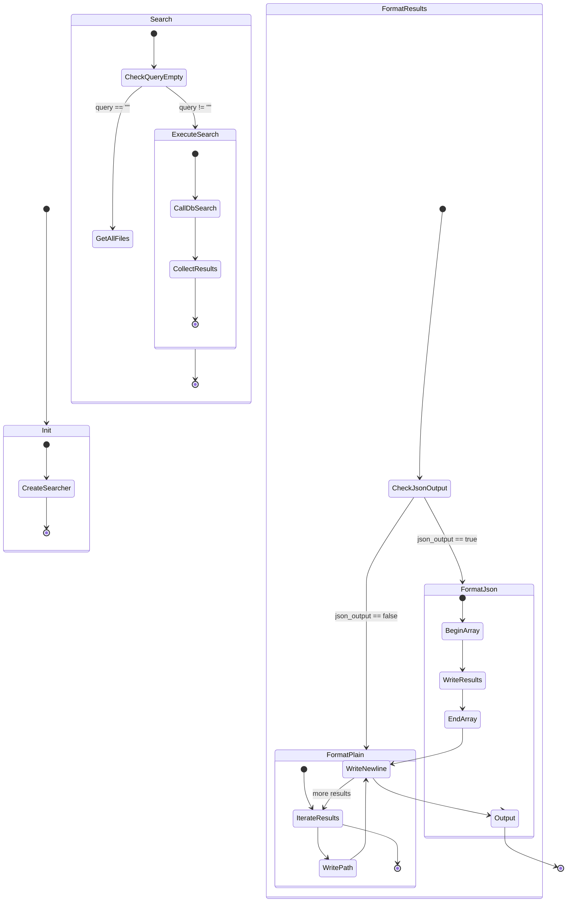
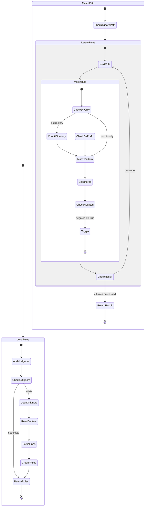

# State Machine Diagrams

This document contains state machine diagrams for the ffts-grep components.

## 1. Main Application Flow

```mermaid
stateDiagram-v2
    [*] --> ParseArgs: main()

    state ParseArgs {
        [*] --> ReadArgs
        ReadArgs --> CheckFlag: --help
        ReadArgs --> CheckFlag: --version
        ReadArgs --> CheckFlag: --index
        ReadArgs --> CheckFlag: --reindex
        ReadArgs --> CheckFlag: --benchmark
        ReadArgs --> CheckFlag: --json
        ReadArgs --> CheckFlag: --paths
        ReadFlag --> ExtractValue: --project-dir=*
        ReadArgs --> ExtractQuery: positional arg
        CheckFlag --> [*]
    }

    ParseArgs --> ResolveProjectDir
    ResolveProjectDir --> BuildDbPath

    state BuildDbPath {
        [*] --> CheckAbsolute
        CheckAbsolute --> AbsolutePath
        CheckAbsolute --> RelativePath: not absolute
        RelativePath --> GetCwd
        GetCwd --> JoinPath
        AbsolutePath --> [*]
        JoinPath --> [*]
    }

    BuildDbPath --> OpenDatabase

    OpenDatabase --> Decision

    state Decision {
        [*] --> CheckReindex
        CheckReindex --> DeleteDb: opts.reindex == true
        CheckReindex --> OpenExisting: opts.reindex == false
        DeleteDb --> InitNewDb
        InitNewDb --> RunIndexing
        OpenExisting --> CheckIndex
        CheckIndex --> RunIndexing: opts.index == true
        CheckIndex --> CheckBenchmark
        CheckBenchmark --> RunBenchmark: opts.benchmark == true
        CheckBenchmark --> PrepareQuery: opts.benchmark == false
    }

    state RunIndexing {
        [*] --> CreateIndexer
        CreateIndexer --> WalkDirectory
        WalkDirectory --> ProcessFile
        ProcessFile --> CheckBatchSize
        CheckBatchSize --> CommitTransaction: batch_size >= limit
        CheckBatchSize --> ProcessFile: more files
        CommitTransaction --> ProcessFile
        ProcessFile --> CheckMoreFiles
        CheckMoreFiles --> CloseTransaction: no more files
        CloseTransaction --> [*]
    }

    state PrepareQuery {
        [*] --> CheckQueryArg
        CheckQueryArg --> UseArg: query provided
        CheckQueryArg --> ReadStdin: no query arg
        ReadStdin --> ParseJsonOrPlain
        ParseJsonOrPlain --> CreateSearcher
        UseArg --> CreateSearcher
    }

    state CreateSearcher {
        [*] --> BuildConfig
        BuildConfig --> InitSearcher
        InitSearcher --> ExecuteSearch
    }

    state ExecuteSearch {
        [*] --> CheckEmptyQuery
        CheckEmptyQuery --> DbGetAllFiles: query == ""
        CheckEmptyQuery --> DbSearch: query != ""
        DbGetAllFiles --> FormatResults
        DbSearch --> FormatResults
    }

    state FormatResults {
        [*] --> CheckJsonFlag
        CheckJsonFlag --> FormatJson: opts.json == true
        CheckJsonFlag --> FormatPlain: opts.json == false
        FormatJson --> OutputResults
        FormatPlain --> OutputResults
    }

    OutputResults --> [*]
```

## 2. Indexer State Machine

## 3. Database Lifecycle

## 4. FTS5 Trigger Synchronization

## 5. Searcher Flow

## 6. Ignore Rule Matching Flow

## Component Summary

| Component | States | Transitions | Key Responsibility |
|-----------|--------|-------------|-------------------|
| Main Flow | 8 | 12 | CLI → Operation routing |
| Indexer | 6 | 15 | File discovery → DB upsert |
| Database | 4 | 12 | SQLite lifecycle + FTS5 |
| FTS5 Triggers | 3 | 6 | Automatic index sync |
| Searcher | 4 | 8 | Query → Results → Format |
| Ignore Rules | 2 | 10 | Pattern matching |
