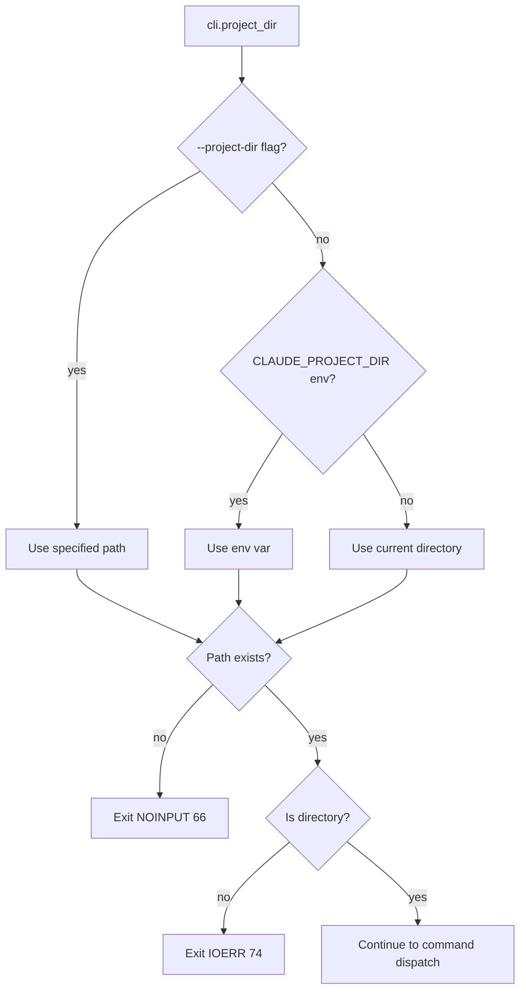

# CLI Command Dispatch State Machine

Entry point state machine showing how CLI arguments are parsed and dispatched to appropriate handlers.

## Main Entry Flow

```mermaid
stateDiagram-v2
    [*] --> ParseArgs: main()

    ParseArgs --> InitLogging: Cli::parse()
    InitLogging --> ResolveProjectDir: if !quiet

    ResolveProjectDir --> ValidateDir

    state ValidateDir {
        [*] --> CheckExists
        CheckExists --> CheckIsDir: exists
        CheckExists --> ExitNoInput: !exists
        CheckIsDir --> BuildPragmaConfig: is_dir
        CheckIsDir --> ExitIoErr: !is_dir
    }

    BuildPragmaConfig --> DispatchCommand

    state DispatchCommand {
        [*] --> CheckCommand
        CheckCommand --> Doctor: Commands::Doctor
        CheckCommand --> Init: Commands::Init
        CheckCommand --> Index: Commands::Index
        CheckCommand --> Search: Commands::Search
        CheckCommand --> CheckQuery: None

        CheckQuery --> ImplicitSearch: cli.query_string().is_some()
        CheckQuery --> CheckStdin: query empty

        CheckStdin --> ParseStdinJson: !stdin.is_terminal()
        CheckStdin --> ExitOk: is_terminal (no input)

        ParseStdinJson --> StdinSearch: valid JSON with query
        ParseStdinJson --> ExitOk: invalid/empty
    }

    Doctor --> Exit
    Init --> Exit
    Index --> Exit
    Search --> Exit
    ImplicitSearch --> Exit
    StdinSearch --> Exit
    ExitOk --> Exit
    ExitNoInput --> Exit
    ExitIoErr --> Exit

    Exit --> [*]
```

## Stdin JSON Parsing (Claude Code Integration)

```mermaid
flowchart TD
    A[No subcommand, no query] --> B{stdin.is_terminal()?}
    B -->|yes| C[Exit 0 - no input]
    B -->|no| D[Read one line from stdin]
    D --> E{Parse as JSON}
    E -->|Err| C
    E -->|Ok StdinQuery| F{query.is_empty()?}
    F -->|yes| C
    F -->|no| G[Split query by whitespace]
    G --> H[run_search with auto-init]
```

## Exit Codes Mapping

| Exit Code | Constant | Triggers |
|-----------|----------|----------|
| 0 | `OK` | Success, no input |
| 1 | `GENERAL` | General error |
| 65 | `DATAERR` | Empty database, wrong app ID, search fail |
| 66 | `NOINPUT` | Project dir resolution failed |
| 70 | `SOFTWARE` | Schema init fail, indexing fail, output fail |
| 74 | `IOERR` | Project dir not exists/not dir, DB open fail |
| 77 | `NOPERM` | Database unreadable |

## Project Directory Resolution


