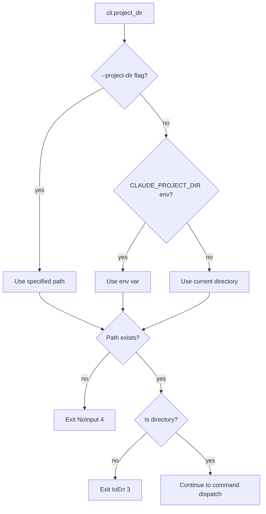

# CLI Command Dispatch State Machine

Entry point state machine showing how CLI arguments are parsed and dispatched to appropriate handlers.

## Main Entry Flow

```mermaid
stateDiagram-v2
    [*] --> ParseArgs: main()

    ParseArgs --> InitLogging: Cli::parse()
    InitLogging --> ResolveProjectDir: if !quiet

    ResolveProjectDir --> ValidateDir

    state ValidateDir {
        [*] --> CheckExists
        CheckExists --> CheckIsDir: exists
        CheckExists --> ExitNoInput: !exists
        CheckIsDir --> BuildPragmaConfig: is_dir
        CheckIsDir --> ExitIoErr: !is_dir
    }

    BuildPragmaConfig --> ValidateRefresh

    state ValidateRefresh {
        [*] --> CheckRefresh
        CheckRefresh --> DispatchCommand: refresh ok or not set
        CheckRefresh --> ExitDataErr: refresh used with index/init/doctor
    }

    state DispatchCommand {
        [*] --> CheckCommand
        CheckCommand --> Doctor: Commands::Doctor
        CheckCommand --> Init: Commands::Init
        CheckCommand --> Index: Commands::Index
        CheckCommand --> Search: Commands::Search
        CheckCommand --> CheckQuery: None

        CheckQuery --> ImplicitSearch: cli.query_string().is_some()
        CheckQuery --> CheckStdin: query empty

        CheckStdin --> ParseStdinJson: !stdin.is_terminal()
        CheckStdin --> ExitDataErr: refresh set + stdin terminal
        CheckStdin --> ExitOk: is_terminal (no input)

        ParseStdinJson --> StdinSearch: valid JSON with query (refresh optional)
        ParseStdinJson --> ExitDataErr: refresh set + invalid/empty
        ParseStdinJson --> ExitOk: invalid/empty (no refresh)
    }

    Doctor --> Exit
    Init --> Exit
    Index --> Exit
    Search --> Exit
    ImplicitSearch --> Exit
    StdinSearch --> Exit
    ExitOk --> Exit
    ExitNoInput --> Exit
    ExitIoErr --> Exit
    ExitDataErr --> Exit

    Exit --> [*]
```

## Stdin JSON Parsing (Claude Code Integration)

```mermaid
flowchart TD
    A[No subcommand, no query] --> B{stdin.is_terminal()?}
    B -->|yes| C{refresh set?}
    C -->|yes| D[Exit 2 - DataErr]
    C -->|no| E[Exit 0 - no input]
    B -->|no| F[Read one line from stdin]
    F --> G{Parse as JSON}
    G -->|Err| H{refresh set?}
    H -->|yes| D
    H -->|no| E
    G -->|Ok StdinQuery| I{query.is_empty()?}
    I -->|yes| J{refresh set?}
    J -->|yes| D
    J -->|no| E
    I -->|no| K[Split query by whitespace]
    K --> L[run_search with refresh? (cli or stdin)]
```

## Exit Codes Mapping

| Exit Code | Constant | Triggers |
|-----------|----------|----------|
| 0 | `Ok` | Success, no input |
| 1 | `Software` | General error |
| 2 | `DataErr` | Invalid args, search fail, wrong app ID |
| 3 | `IoErr` | Project dir not exists/not dir, DB open fail |
| 4 | `NoInput` | Project dir resolution failed |
| 5 | `NoPerm` | Database unreadable |

## Project Directory Resolution


