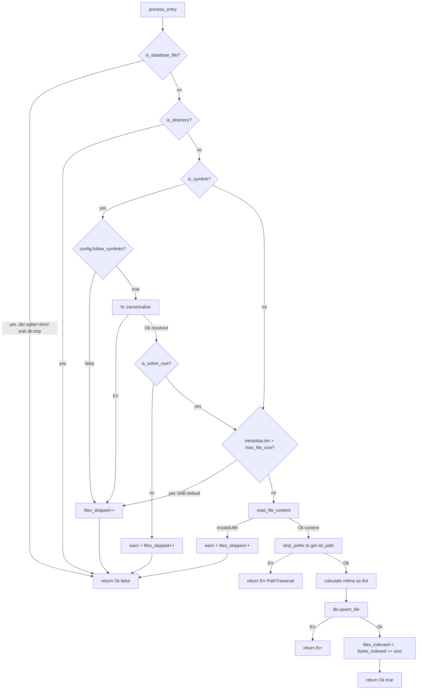
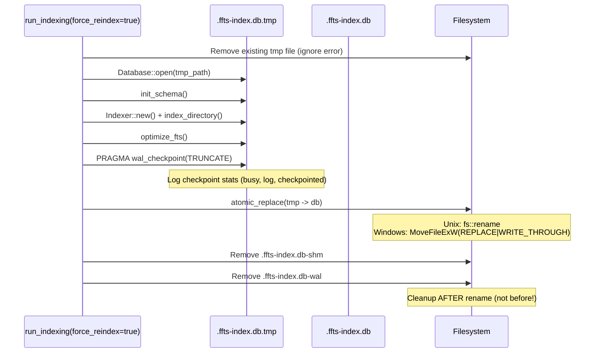

# Indexer Lifecycle State Machine

Shows the complete indexing process including **conditional transaction strategy**.

## Key Design: Conditional Transactions

```
THRESHOLD = 50 files   → Start transaction after this many files
BATCH_SIZE = 500 files → Commit and restart transaction at this count
```

**Why?** Transaction overhead dominates for small operations. Below 50 files, autocommit is faster.

## Main Indexer Flow

```mermaid
stateDiagram-v2
    [*] --> New: Indexer::new(root, db, config)

    New --> Initialize: index_directory()

    state Initialize {
        [*] --> SetupWalk
        SetupWalk --> InitStats: WalkBuilder::new().standard_filters(true).same_file_system(true)
        InitStats --> SetCounters: stats = IndexStats::default()
        SetCounters --> [*]: batch_count=0, transaction_started=false
    }

    Initialize --> WalkLoop

    state WalkLoop {
        [*] --> GetNextEntry
        GetNextEntry --> ProcessEntry: Ok(entry)
        GetNextEntry --> LogWalkError: Err(e)
        LogWalkError --> GetNextEntry: warn and continue

        ProcessEntry --> HandleResult
        HandleResult --> IncrementBatch: Ok(true) needs_commit
        HandleResult --> GetNextEntry: Ok(false) skipped
        HandleResult --> LogFileError: Err(e)
        LogFileError --> IncrementSkipped
        IncrementSkipped --> GetNextEntry

        IncrementBatch --> CheckThreshold
        CheckThreshold --> StartTransaction: batch_count == 50 && !transaction_started
        CheckThreshold --> CheckBatchSize: already in transaction OR below threshold

        StartTransaction --> BeginImmediate: BEGIN IMMEDIATE
        BeginImmediate --> SetStarted: transaction_started = true
        SetStarted --> CheckBatchSize

        CheckBatchSize --> CommitAndRestart: transaction_started && batch_count >= 500
        CheckBatchSize --> GetNextEntry: continue walking

        CommitAndRestart --> Commit: COMMIT
        Commit --> BeginAgain: BEGIN IMMEDIATE
        BeginAgain --> ResetToThreshold: batch_count = 50 (NOT 0!)
        ResetToThreshold --> GetNextEntry

        GetNextEntry --> WalkComplete: no more entries
    }

    WalkComplete --> Finalize

    state Finalize {
        [*] --> CheckTransaction
        CheckTransaction --> FinalCommit: transaction_started
        CheckTransaction --> RunAnalyze: !transaction_started
        FinalCommit --> RunAnalyze: COMMIT
        RunAnalyze --> RunOptimize: ANALYZE (non-fatal)
        RunOptimize --> RunFtsOptimize: PRAGMA optimize (non-fatal)
        RunFtsOptimize --> [*]: optimize_fts() (non-fatal)
    }

    Finalize --> ReturnStats: Ok(IndexStats)
```

## CRITICAL: batch_count Reset Logic

```rust
// CORRECT: Reset to THRESHOLD, not 0
batch_count = TRANSACTION_THRESHOLD; // 50

// WHY: We're still in a transaction, so we don't want to
// immediately trigger another commit. We set it to 50 so
// the next 450 files will trigger the next commit.
```

## File Processing State Machine



## Atomic Reindex Flow



## Error Handling Strategy

| Error Type | Handling | Continues? |
|------------|----------|------------|
| Walk error | `warn!` and continue | Yes |
| File process error | `warn!`, increment `files_skipped` | Yes |
| Transaction error | Return `Err(IndexerError::Database)` | No |
| ANALYZE/optimize error | `.ok()` ignore | Yes |

## Configuration Defaults

| Parameter | Default | Purpose |
|-----------|---------|---------|
| `max_file_size` | 1MB | Skip files larger than this |
| `batch_size` | 500 | Files per transaction commit |
| `follow_symlinks` | true | Resolve and follow symlinks |
| `TRANSACTION_THRESHOLD` | 50 | Files before starting transaction |
