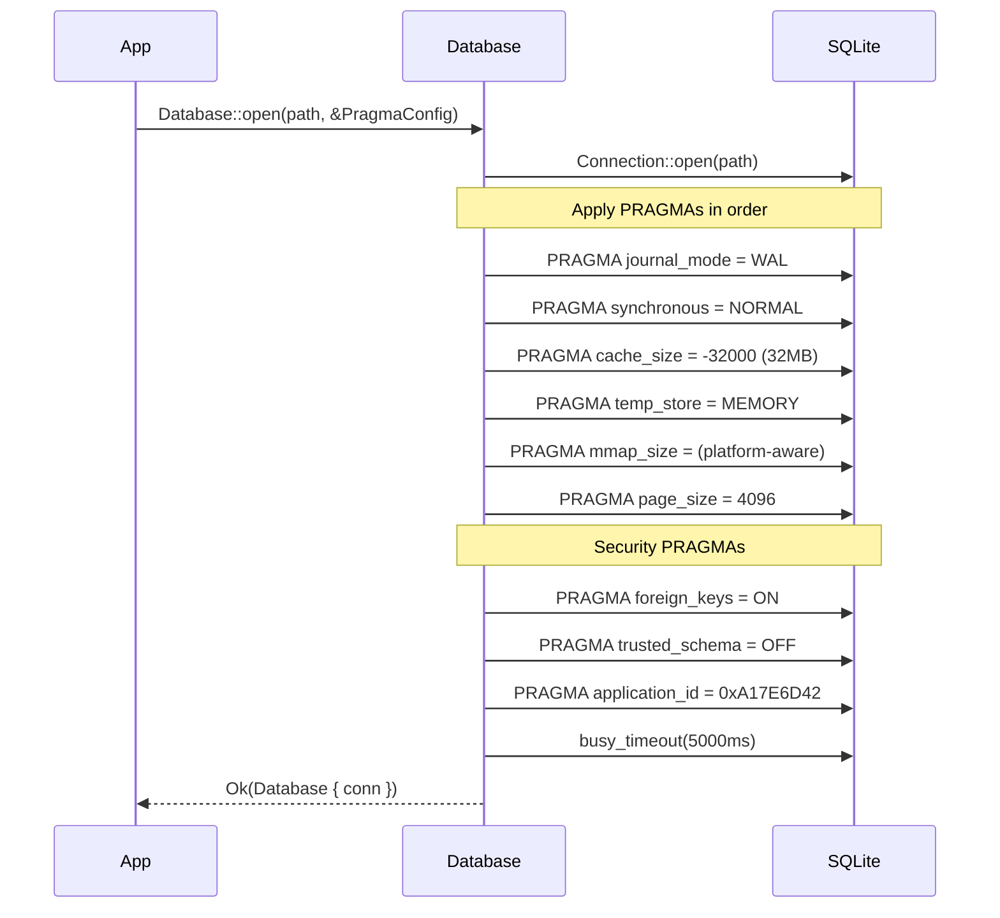
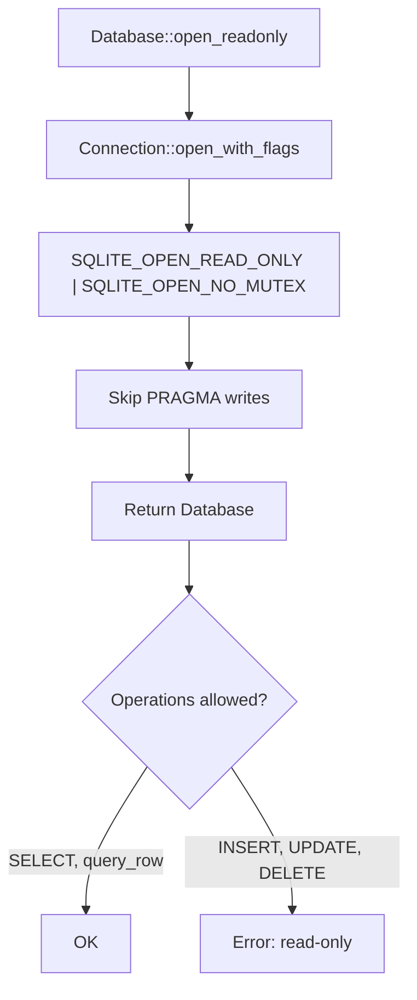
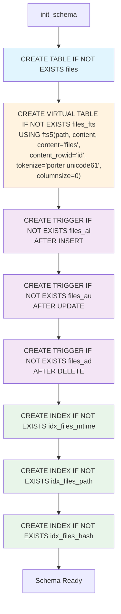
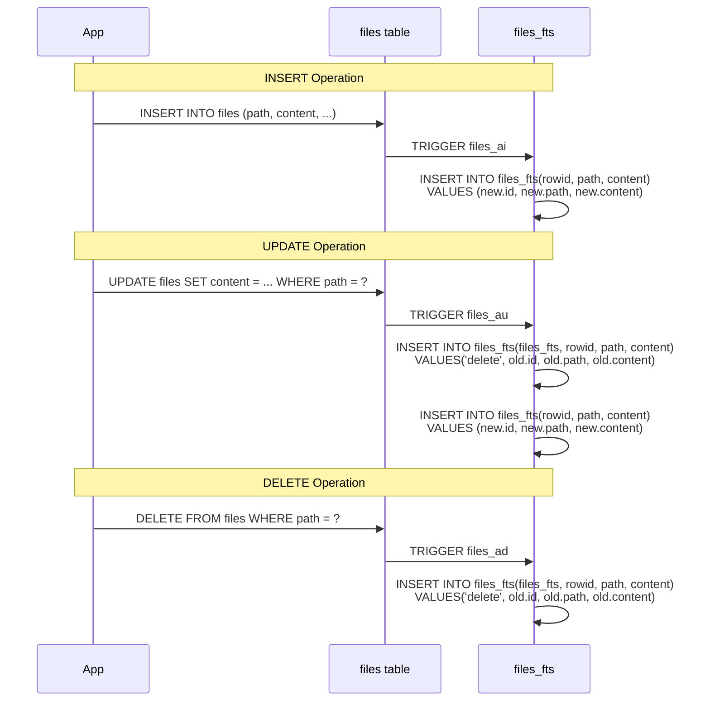
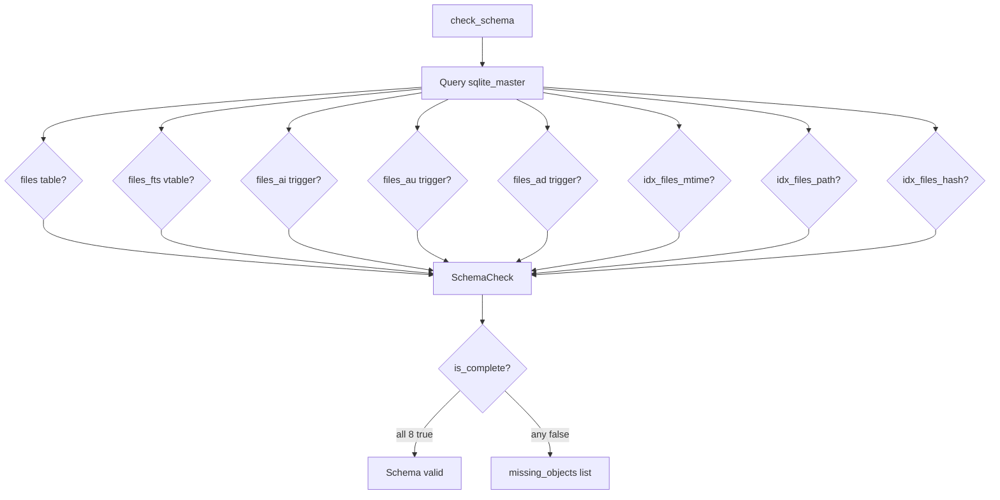

# Database Connection & Transaction States

Shows database lifecycle, PRAGMA configuration, and FTS5 trigger synchronization.

## Database Open Sequence



## Read-Only Mode (Doctor)



## Schema Initialization (Idempotent)



## FTS5 Trigger Auto-Sync



## Upsert with Lazy Invalidation

```mermaid
flowchart TD
    A[upsert_file path, content, mtime, size] --> B[hash = wyhash content]
    B --> C[now = Utc::now.timestamp]
    C --> D["INSERT INTO files<br/>(path, content_hash, mtime, size, indexed_at, content)<br/>VALUES (?, ?, ?, ?, ?, ?)"]

    D --> E["ON CONFLICT(path) DO UPDATE SET<br/>content_hash, mtime, size, indexed_at, content"]
    E --> F{"WHERE excluded.content_hash !=<br/>(SELECT content_hash FROM files WHERE path = excluded.path)"}

    F -->|hash differs| G[UPDATE executed]
    G --> H[Triggers fire → FTS5 rebuilt]

    F -->|hash same| I[No update - skip]
    I --> J[No triggers - FTS5 unchanged]

    Note over I,J: Lazy invalidation:<br/>Same content = no work
```

## Schema Validation



## PRAGMA Configuration Reference

| PRAGMA | Default | Platform Notes |
|--------|---------|----------------|
| `journal_mode` | WAL | Enables concurrent readers |
| `synchronous` | NORMAL | Balance durability/performance |
| `cache_size` | -32000 (32MB) | Negative = KB |
| `temp_store` | MEMORY | Temp tables in RAM |
| `mmap_size` | 0 (macOS) / 256MB (Linux) | macOS: unreliable on APFS |
| `page_size` | 4096 | Standard |
| `foreign_keys` | ON | Referential integrity |
| `trusted_schema` | OFF | Security: prevent SQL injection via schema |
| `application_id` | 0xA17E6D42 | Database signature |
| `busy_timeout` | 5000ms | Concurrent access retry |
