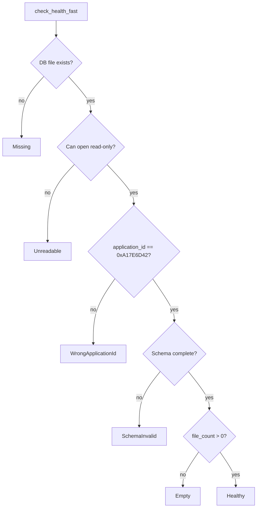
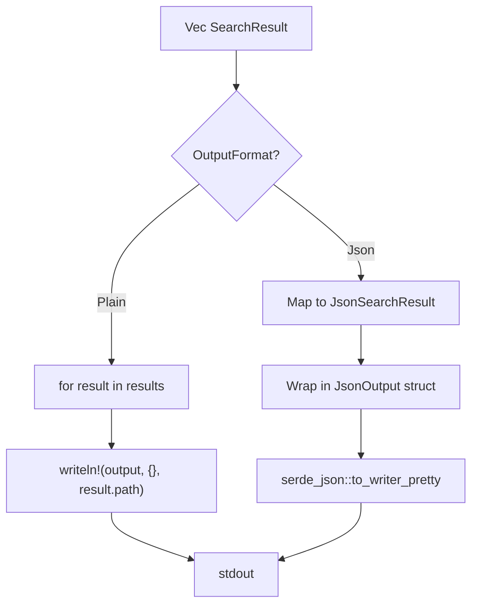
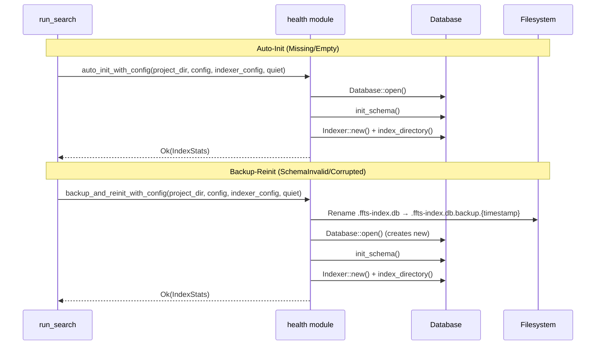

# Search Query Execution Flow

Shows the complete search pipeline including health-gated auto-init.

## Search State Machine

```mermaid
stateDiagram-v2
    [*] --> HealthCheck: run_search()

    state HealthCheck {
        [*] --> CheckHealthFast: health::check_health_fast()
        CheckHealthFast --> Healthy
        CheckHealthFast --> Missing
        CheckHealthFast --> Empty
        CheckHealthFast --> SchemaInvalid
        CheckHealthFast --> Corrupted
        CheckHealthFast --> WrongApplicationId
        CheckHealthFast --> Unreadable
    }

    Healthy --> RefreshCheck

    state "Auto-Init Path" as AutoInit {
        Missing --> CheckAutoInit: !no_auto_init
        Empty --> CheckAutoInit
        CheckAutoInit --> DoAutoInit: auto_init enabled
        DoAutoInit --> RefreshCheck: success
        DoAutoInit --> ExitSoftware: failure
    }

    state "Reinit Path" as Reinit {
        SchemaInvalid --> CheckAutoInitReinit: !no_auto_init
        Corrupted --> CheckAutoInitReinit
        CheckAutoInitReinit --> DoBackupReinit: auto_init enabled
        DoBackupReinit --> RefreshCheck: success
        DoBackupReinit --> ExitSoftware: failure
    }

    state "No Auto-Init" as NoAuto {
        Missing --> ExitDataErr: no_auto_init=true
        Empty --> ExitDataErr
        SchemaInvalid --> ExitDataErr
        Corrupted --> ExitDataErr
    }

    WrongApplicationId --> ExitDataErr: Different app's DB
    Unreadable --> ExitNoPerm: Permission denied

    state "Wildcard" as Wild {
        [*] --> ExitSoftware: Unknown health state
    }

    state RefreshCheck {
        [*] --> RefreshGate
        RefreshGate --> RefreshIndex: refresh && !already_indexed
        RefreshGate --> OpenDatabase: no refresh or already indexed
        RefreshIndex --> OpenDatabase
    }

    OpenDatabase --> InitSchema
    InitSchema --> CreateSearcher
    CreateSearcher --> ExecuteSearch

    state ExecuteSearch {
        [*] --> SanitizeQuery
        SanitizeQuery --> CheckEmpty
        CheckEmpty --> ReturnEmpty: empty after sanitize
        CheckEmpty --> BuildSQL: has content
        BuildSQL --> Execute
        Execute --> Collect
        Collect --> [*]
    }

    ExecuteSearch --> FormatResults
    FormatResults --> ExitOk
```

## Health Check States (DatabaseHealth enum)



## Query Sanitization

```mermaid
flowchart LR
    A[Raw Query] --> B["Remove FTS5 special chars:<br/>* \" ( ) : ^ @ ~ -"]
    B --> C[Collapse whitespace + trim]
    C --> D{Empty after trim?}
    D -->|yes| E[Return empty vec]
    D -->|no| F[Auto-prefix if trailing '-' or '_' ]
    F --> G[Execute FTS5 MATCH]
```

## BM25 Ranking Query

```sql
-- paths_only = false (full search)
SELECT path, bm25(files_fts, 100.0, 50.0, 1.0) AS rank
FROM files_fts
WHERE files_fts MATCH ?1
ORDER BY rank
LIMIT ?2

-- paths_only = true
SELECT path, bm25(files_fts, 100.0, 50.0, 1.0) AS rank
FROM files_fts
WHERE path MATCH ?1  -- Only match path column
ORDER BY rank
LIMIT ?2
```

| Column | BM25 Weight | Effect |
|--------|-------------|--------|
| filename | 100.0 | Exact filename matches rank highest |
| path | 50.0 | Path matches ranked 50x higher |
| content | 1.0 | Baseline content ranking |

**Note:** Lower BM25 score = better match (it's a cost function).

## Output Formatting



## Auto-Init and Backup-Reinit



## Exit Code Mapping

| Health State | Auto-Init | Exit Code |
|--------------|-----------|-----------|
| Healthy | N/A | Continue |
| Missing/Empty | enabled | Continue (after init) |
| Missing/Empty | disabled | DataErr (2) |
| SchemaInvalid/Corrupted | enabled | Continue (after reinit) |
| SchemaInvalid/Corrupted | disabled | DataErr (2) |
| WrongApplicationId | N/A | DataErr (2) |
| Unreadable | N/A | NoPerm (5) |
| Unknown (_) | N/A | Software (1) |
