# Doctor Diagnostic Check Pipeline

Shows the 10-check sequential diagnostic pipeline.

## Doctor Execution Flow

```mermaid
stateDiagram-v2
    [*] --> New: Doctor::new(project_dir, verbose)

    New --> Run: doctor.run()

    state Run {
        [*] --> Check1: database_exists
        Check1 --> Check2: database_readable
        Check2 --> Check3: application_id
        Check3 --> Check4: schema_complete
        Check4 --> Check5: fts_integrity
        Check5 --> Check6: journal_mode
        Check6 --> Check7: file_count
        Check7 --> Check8: gitignore
        Check8 --> Check9: binary_available
        Check9 --> Check10: orphan_wal_files
        Check10 --> [*]
    }

    Run --> CompileSummary
    CompileSummary --> Output: DoctorSummary
    Output --> [*]: ExitCode
```

## Check Pipeline with Severity

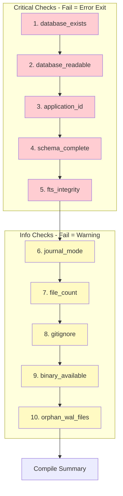

## Individual Check Details

### Check 1: database_exists
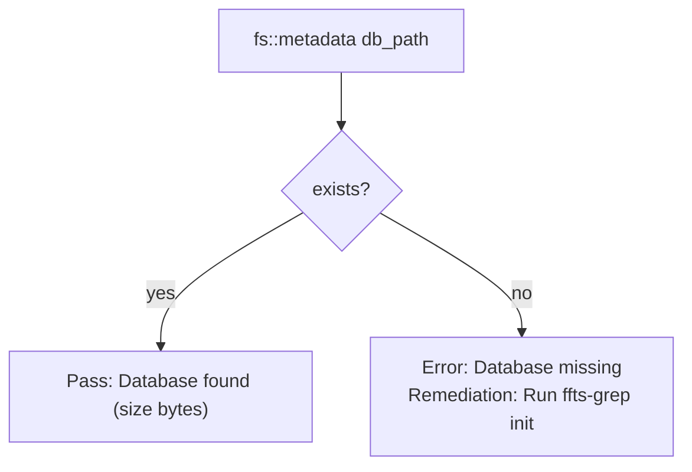

### Check 2: database_readable
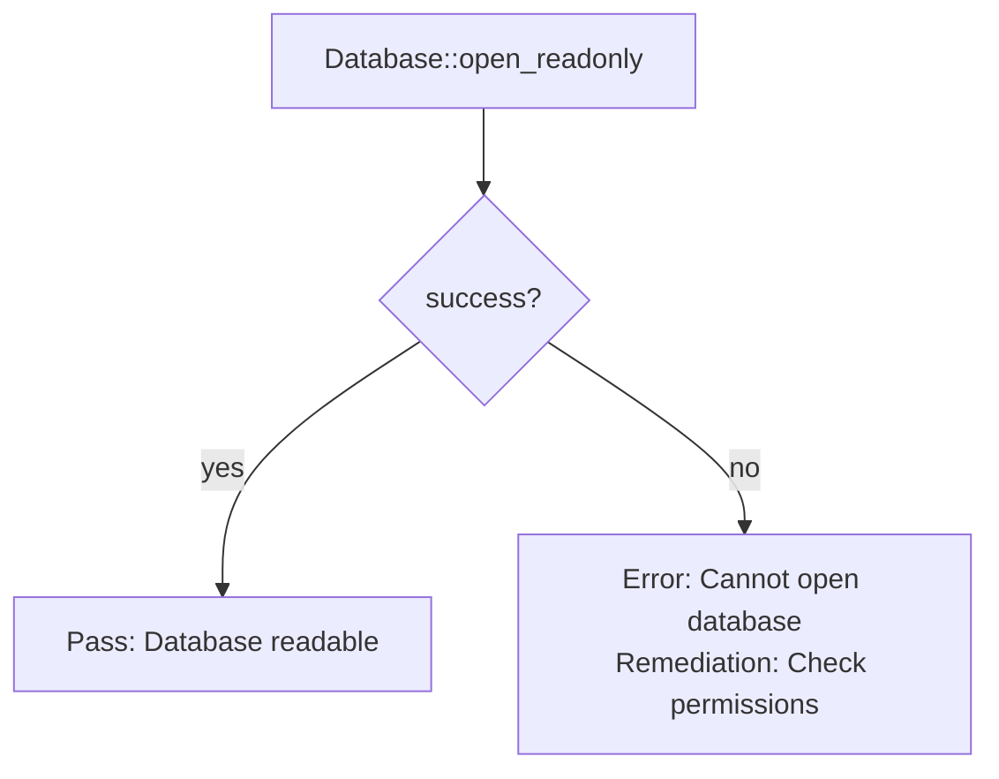

### Check 3: application_id
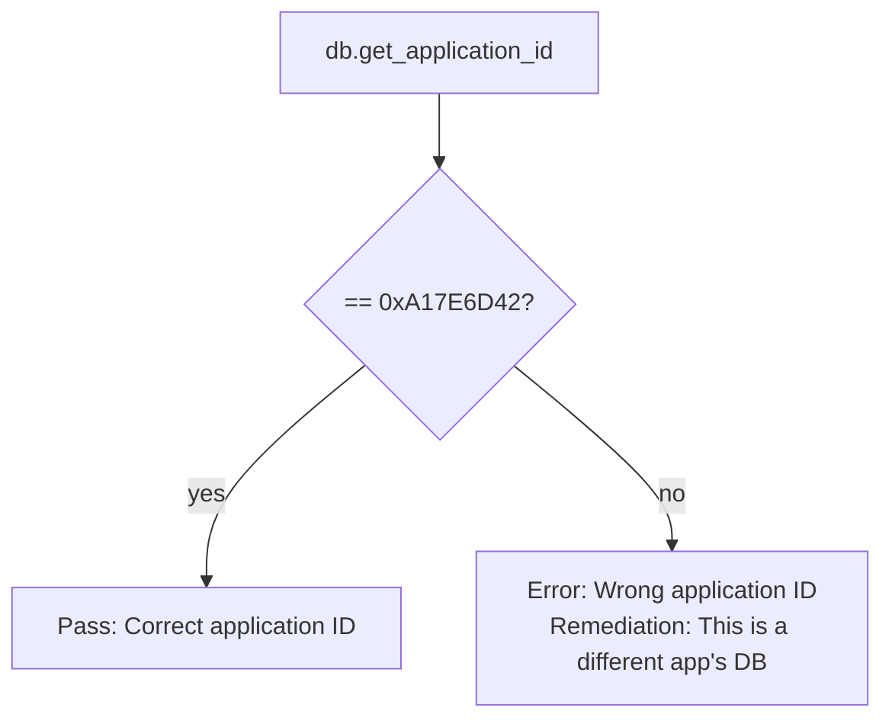

### Check 4: schema_complete
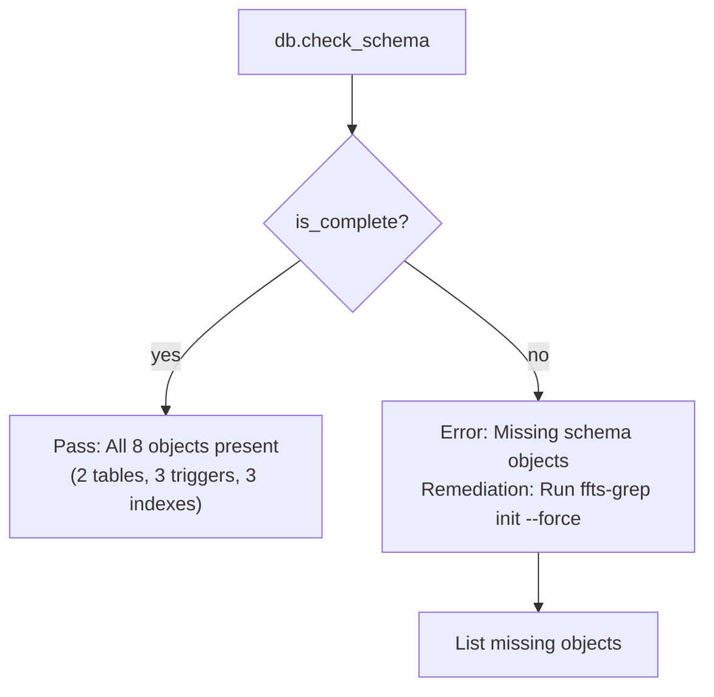

### Check 5: fts_integrity
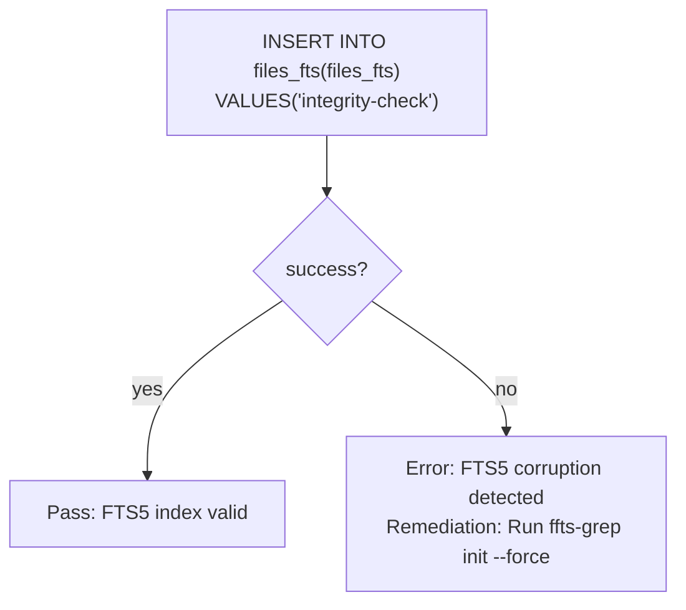

### Check 6: journal_mode
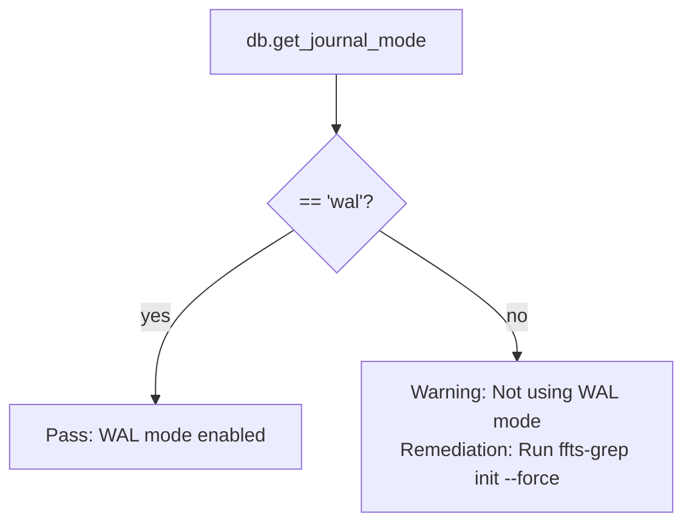

### Check 7: file_count
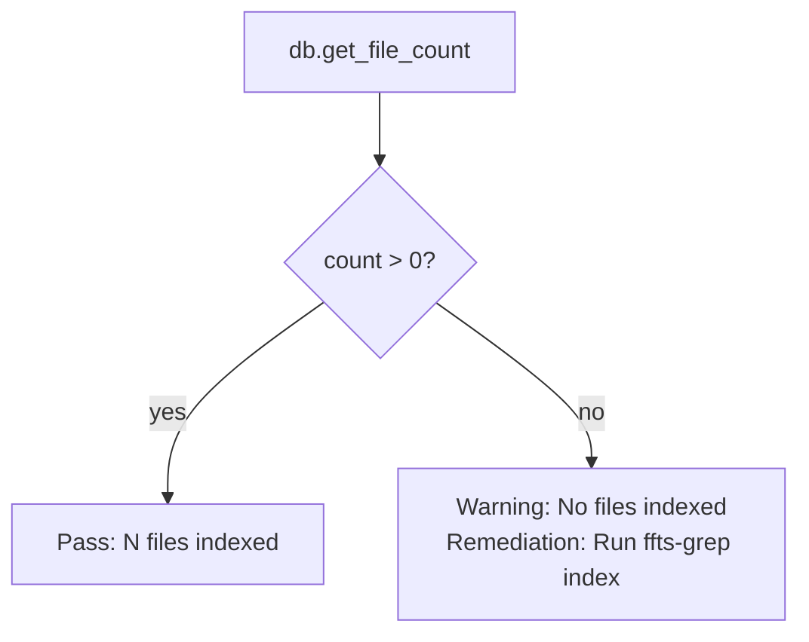

### Check 8: gitignore
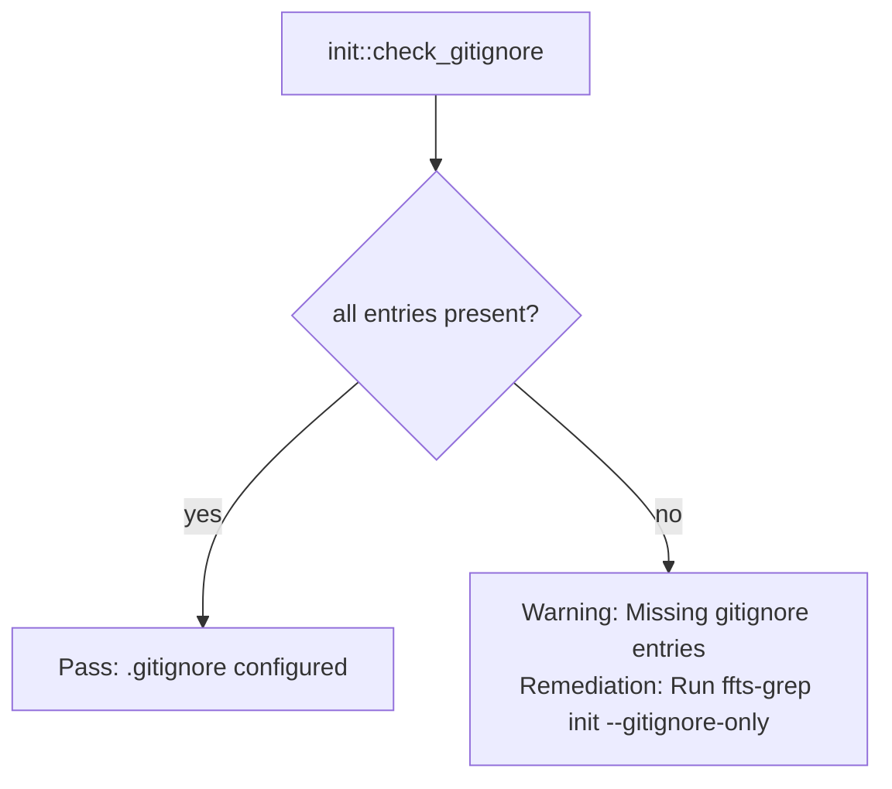

### Check 9: binary_available
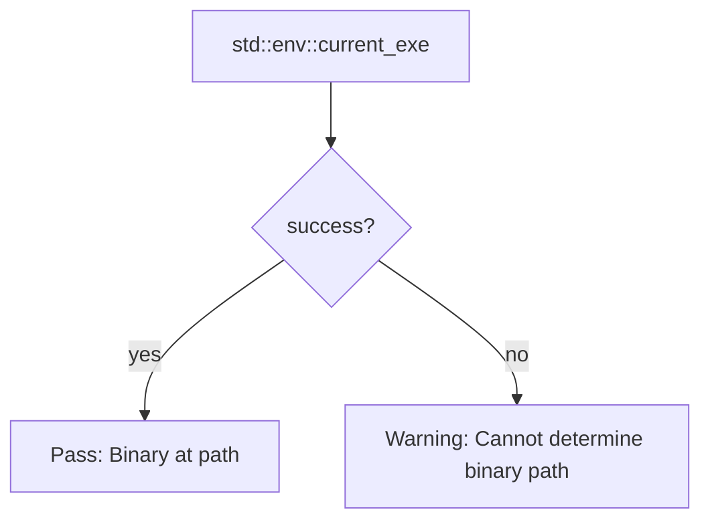

### Check 10: orphan_wal_files
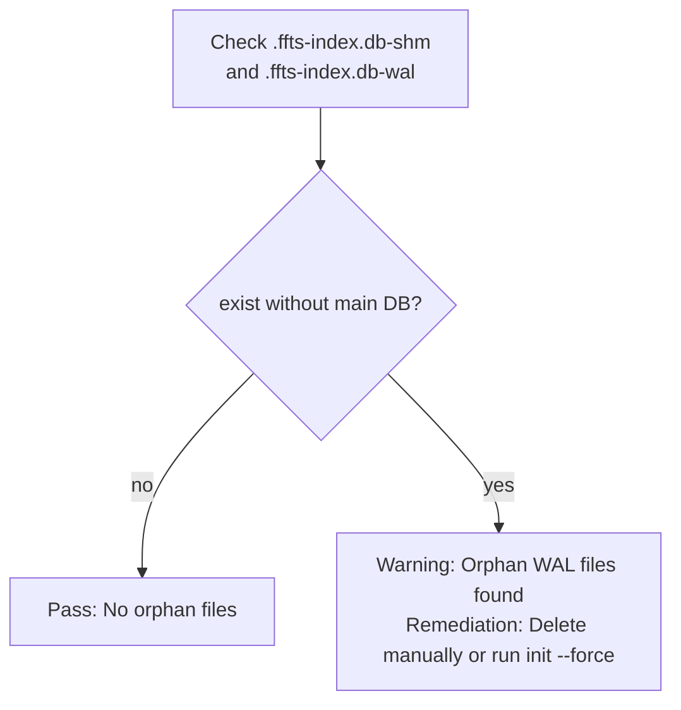

## Output Format States

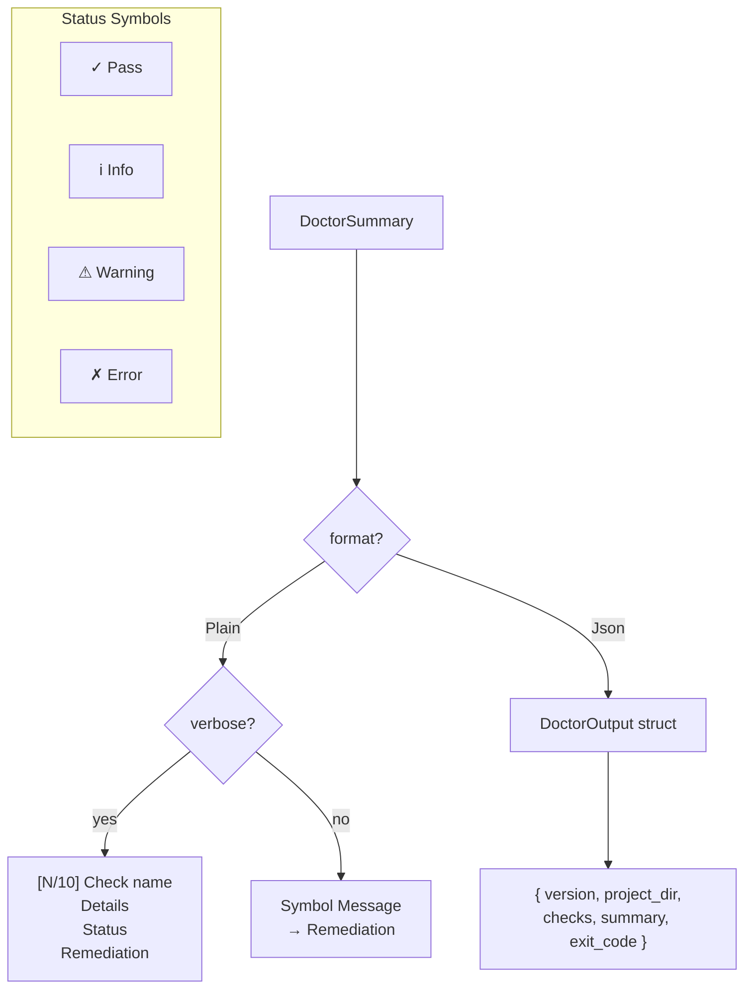

## Exit Code Calculation

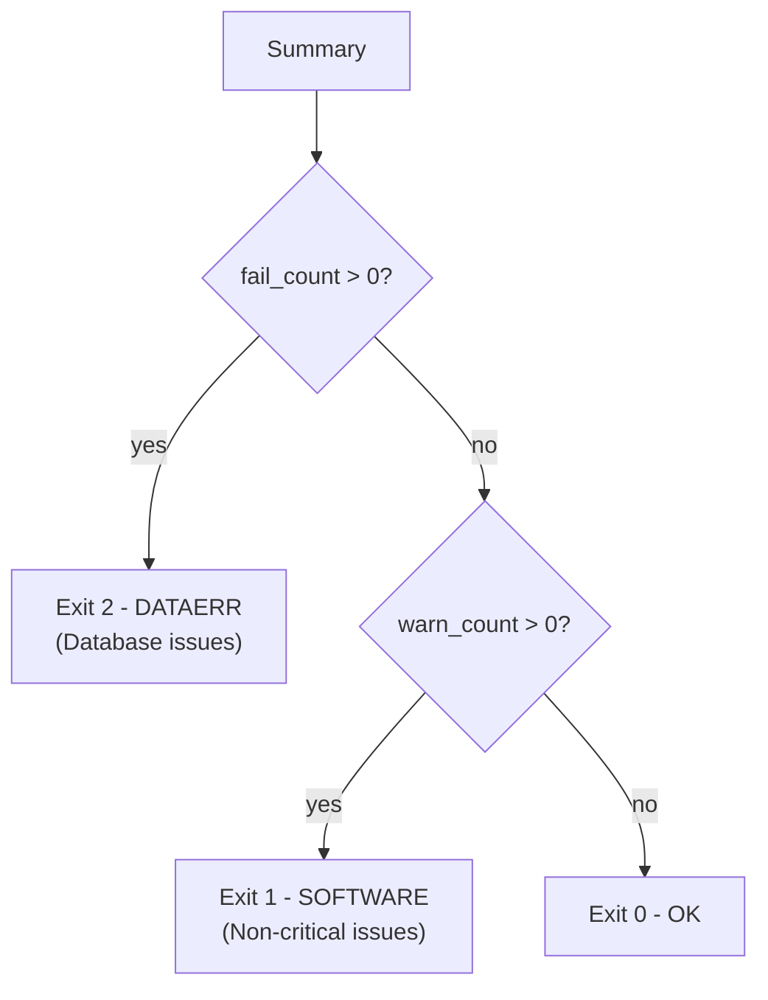

## Check Summary Table

| # | Check | Severity | Pass Condition |
|---|-------|----------|----------------|
| 1 | database_exists | Error | File exists |
| 2 | database_readable | Error | Can open read-only |
| 3 | application_id | Error | ID == 0xA17E6D42 |
| 4 | schema_complete | Error | All 8 objects exist |
| 5 | fts_integrity | Error | integrity-check passes |
| 6 | journal_mode | Warning | mode == 'wal' |
| 7 | file_count | Warning | count > 0 |
| 8 | gitignore | Warning | All 4 entries present |
| 9 | Binary availability | Warning | current_exe() succeeds |
| 10 | orphan_wal_files | Warning | No orphan -shm/-wal files |
