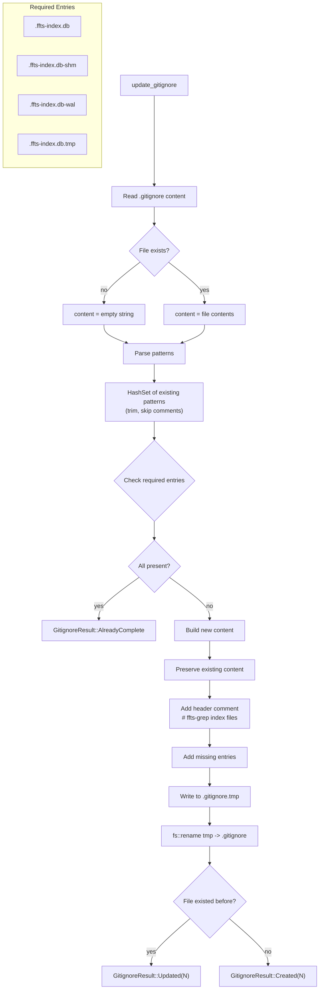
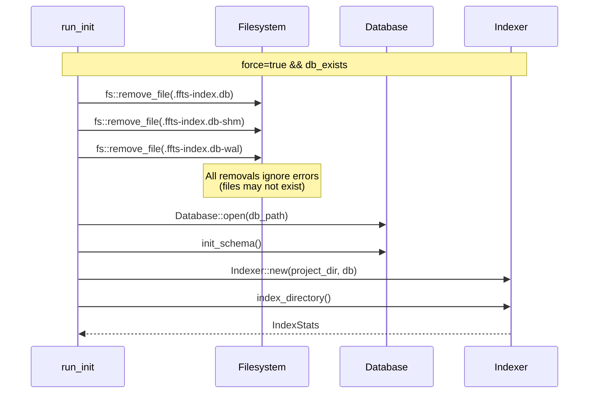
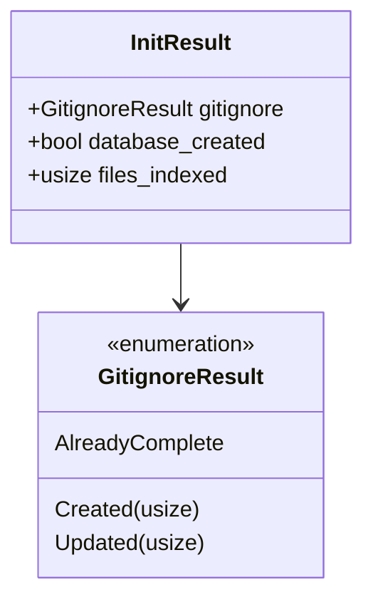
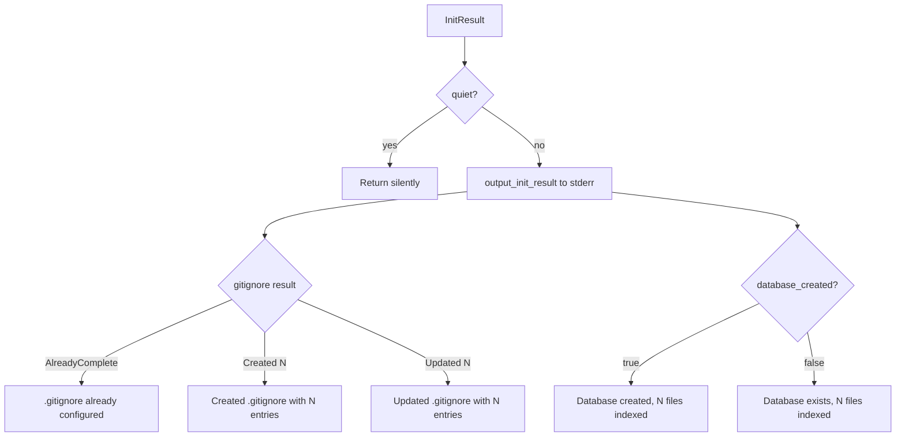

# Project Initialization State Machine

Shows the init command flow including gitignore updates and force mode.

## Init Execution Flow

```mermaid
stateDiagram-v2
    [*] --> UpdateGitignore: run_init()

    state UpdateGitignore {
        [*] --> CallUpdate: init::update_gitignore()
        CallUpdate --> GitignoreResult: Ok
        CallUpdate --> ExitIoErr: Err
    }

    GitignoreResult --> CheckGitignoreOnly

    CheckGitignoreOnly --> OutputAndExit: gitignore_only=true
    CheckGitignoreOnly --> CheckDbExists: gitignore_only=false

    state CheckDbExists {
        [*] --> DbExists: db_path.exists()
        DbExists --> OpenExisting: exists && !force
        DbExists --> DeleteExisting: exists && force
        DbExists --> CreateNew: !exists
    }

    state OpenExisting {
        [*] --> OpenDb: Database::open()
        OpenDb --> GetCount: db.get_file_count()
        GetCount --> OutputResult: report existing count
    }

    state DeleteExisting {
        [*] --> RemoveDb: fs::remove_file(db)
        RemoveDb --> RemoveShm: fs::remove_file(db-shm)
        RemoveShm --> RemoveWal: fs::remove_file(db-wal)
        RemoveWal --> CreateNew
    }

    state CreateNew {
        [*] --> OpenNewDb: Database::open()
        OpenNewDb --> InitSchema: db.init_schema()
        InitSchema --> IndexFiles: Indexer::new() + index_directory()
        IndexFiles --> OutputResult
    }

    OutputResult --> OutputInitResult
    OutputInitResult --> ExitOk

    OutputAndExit --> ExitOk
```

## Gitignore Update State Machine



## Force Reinit Cleanup



## InitResult Structure



## CLI Flags Impact

| Flag | Gitignore | Database | Indexing |
|------|-----------|----------|----------|
| (none) | Update if needed | Open existing or create | Index if new |
| `--gitignore-only` | Update if needed | Skip | Skip |
| `--force` | Update if needed | Delete + recreate | Full reindex |
| `--force --gitignore-only` | Update if needed | Skip | Skip |

## Output Flow



## Error Exit Points

| Error | Exit Code | Message |
|-------|-----------|---------|
| Gitignore write fail | IOERR (74) | Failed to update .gitignore |
| DB open fail | IOERR (74) | Failed to open/create database |
| Schema init fail | SOFTWARE (70) | Failed to initialize schema |
| Index fail | SOFTWARE (70) | Indexing failed during initialization |
| Output fail | SOFTWARE (70) | Failed to output init results |
