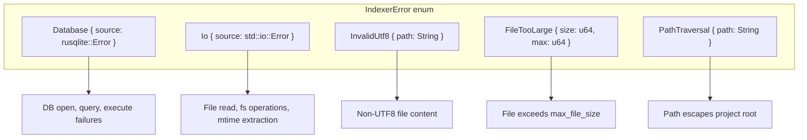
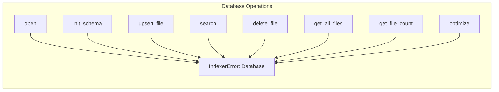
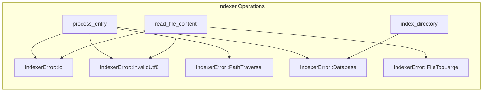
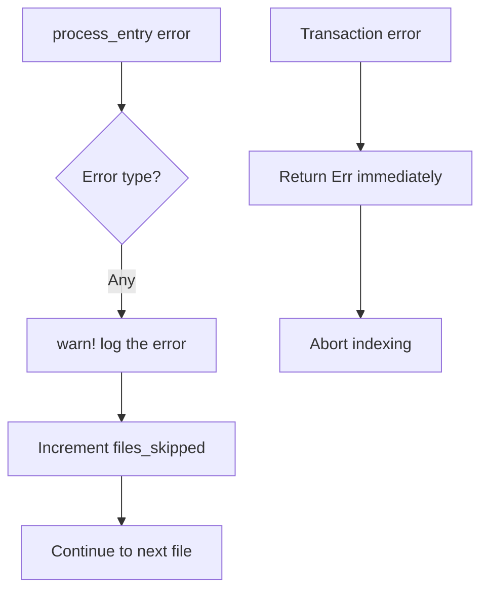
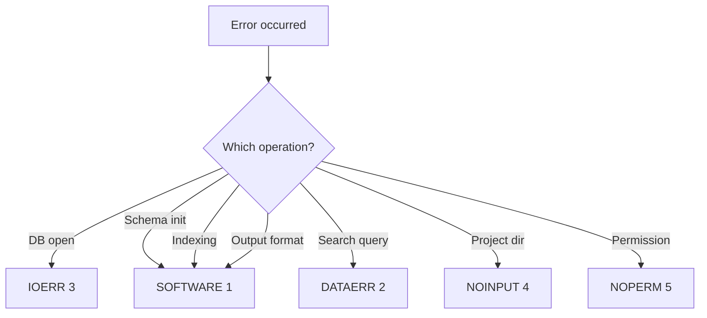

# Error Type Hierarchy

Documents the `IndexerError` enum and error propagation paths.

## IndexerError Variants



## Error Sources by Component

### Database (db.rs)


### Indexer (indexer.rs)


## Error Handling Strategy

### Indexer: Graceful Degradation


### Main: Exit Code Mapping


**Note:** Uses custom exit codes (1-5), not BSD sysexits.h values.

## Error Display Formatting

```rust
impl std::fmt::Display for IndexerError {
    fn fmt(&self, f: &mut std::fmt::Formatter<'_>) -> std::fmt::Result {
        match self {
            Self::Database { source } =>
                write!(f, "Database error: {source}"),
            Self::Io { source } =>
                write!(f, "I/O error: {source}"),
            Self::InvalidUtf8 { path } =>
                write!(f, "Invalid UTF-8 in file: {path}"),
            Self::FileTooLarge { size, max } =>
                write!(f, "File too large: {size} bytes (max: {max})"),
            Self::PathTraversal { path } =>
                write!(f, "Path traversal attempt: {path}"),
        }
    }
}
```

## Result Type Alias

```rust
pub type Result<T> = std::result::Result<T, IndexerError>;
```

## Error Recovery Patterns

| Error | Recovery | User Action |
|-------|----------|-------------|
| Database::Io (open fail) | None | Check path, permissions |
| Database::Corrupted | backup_and_reinit | Automatic or `init --force` |
| InvalidUtf8 | Skip file | None (binary file) |
| FileTooLarge | Skip file | Increase max_file_size or ignore |
| PathTraversal | Skip file | Check symlinks |
| Transaction fail | Abort operation | Retry or check disk space |
